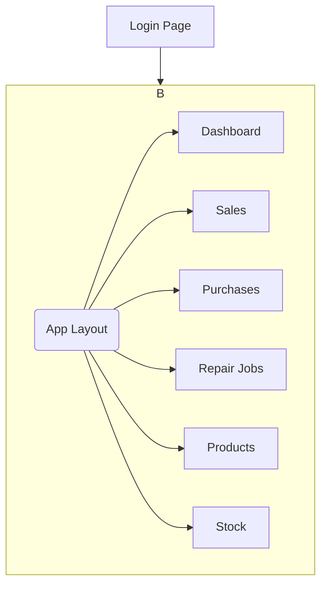

# UI/UX Specification: Back-office Dashboard for Repair Shop

**Version:** 1.0
**Date:** 2025-08-04

-----

## 1\. Introduction

### Overall UX Goals & Principles

#### Target User Personas

  * **Shop Owner/Main User:** A sole operator of the repair shop, responsible for all aspects of the business. Needs a system that reduces manual work and provides a clear business overview.

#### Usability Goals

  * **Ease of learning:** The user must be able to learn and complete core tasks (e.g., recording a sale/repair) within the first 5 minutes of use.
  * **Efficiency of use:** Frequently performed tasks must require a minimal number of clicks and be easily accessible.
  * **Error prevention:** Include confirmations before critical actions (e.g., deleting data) to prevent mistakes.

#### Design Principles

1.  **Clarity over cleverness:** Emphasize clarity and ease of understanding over complex, beautiful designs.
2.  **Progressive disclosure:** Show only the necessary information and tools for each step, avoiding a cluttered interface by not showing everything at once.
3.  **Consistent patterns:** Use design patterns (e.g., buttons, tables, forms) consistently throughout the application, based primarily on MUI.

-----

## 2\. Information Architecture (Updated)

### Site Map / Screen Inventory



### Navigation Structure

  * **App Layout:** After logging in, the user enters the main App Layout, which consists of 3 parts:
    1.  **Navbar (Top menu bar):**
          * **Left side:** Will have a Hamburger Menu button to control the **collapsing/expanding** of the Sidebar.
          * **Right side:** Will have a User Menu displaying the username and a Logout button.
    2.  **Sidebar (Side menu bar):**
          * The main menu for accessing different pages (Dashboard, Sales, etc.).
          * Can be collapsed to show only icons and expanded back to its full state.
    3.  **Main Content:**
          * The area where the content of each selected page is displayed.

-----

## 3\. User Flows

### User Flow: Add New Sale (Example)

  * **User Goal:** To quickly and accurately record a sales transaction, including automatically deducting from stock.
  * **Pattern:** This flow will be used as a template for all CRUD-type tasks (adding/editing/deleting data).

<!-- end list -->

```mermaid
graph TD
    A[On the List Page] --> B{Clicks 'Add New' button};
    B --> C[Form (Modal) is displayed];
    C --> D[User fills out the form];
    D --> E{Clicks 'Save'};
    E --> F{Is data valid?};
    F -- Valid --> G[Send data to API];
    F -- Invalid --> H[Display validation message in the form];
    H --> D;
    G --> I{API response successful?};
    I -- Success --> J[Close form and Refresh data];
    I -- Failure --> K[Display Error message];
    K --> D;
    J --> L[End];
```

-----

## 4\. Wireframes & Mockups

### Key Screen Layout: Main Dashboard

  * **Purpose:** To give the user an immediate overview of the most important business statuses.
  * **Key Elements:**
      * **Header:** Title "Business Overview (Dashboard)"
      * **Summary Cards:** The top row displays 4 cards: Today's Revenue, Today's Expenses, New Repair Jobs, New Sales.
      * **Main Chart:** A bar chart showing "Sales for the Last 7 Days".
      * **Secondary Information:** Two columns below showing "Last 5 Repair Jobs" and "5 Products with Low Stock".

### Key Screen Layout: Management Page (e.g., Products)

  * **Purpose:** To display, search, add, edit, and delete data (used as a template for all management pages).
  * **List View:** Consists of a Header, Action Bar (search field and "Add New" button), and a Data Grid with Edit/Delete buttons.
  * **Create/Edit Form:** Displayed as a Modal/Dialog, consisting of Input Fields and Save/Cancel buttons.
  * **Delete Confirmation:** Displayed as a Modal/Dialog with a confirmation message and Confirm/Cancel buttons.
  * **Note:** There will be no separate "View Detail" page in the MVP version.

-----

## 5\. Component Library / Design System

### Design System Approach

We will use **MUI (Material-UI)** as the primary Component Library and Design System for this entire project.

### Core Components

  * **Layout:** `AppBar`, `Drawer`
  * **Data Display:** `Card`, `DataGrid`, `List`, `Typography`
  * **Inputs:** `Button`, `TextField`, `Select`
  * **Feedback:** `Dialog`, `Alert`, `Snackbar`
  * **Charts:** Will use a React-compatible library such as `Recharts` or `Nivo`.

-----

## 6\. Branding & Style Guide (Updated)

### Visual Identity

  * **Material Design**

### Color Palette

  * Use MUI's Default Palette.

### Typography

  * **Font:** **"Prompt"** from Google Fonts.
  * **Type Scale:** Use MUI's standard type scale.

### Iconography

  * **Material Icons**

### Spacing & Layout

  * Use MUI's standard Grid and Spacing scale (8px base).